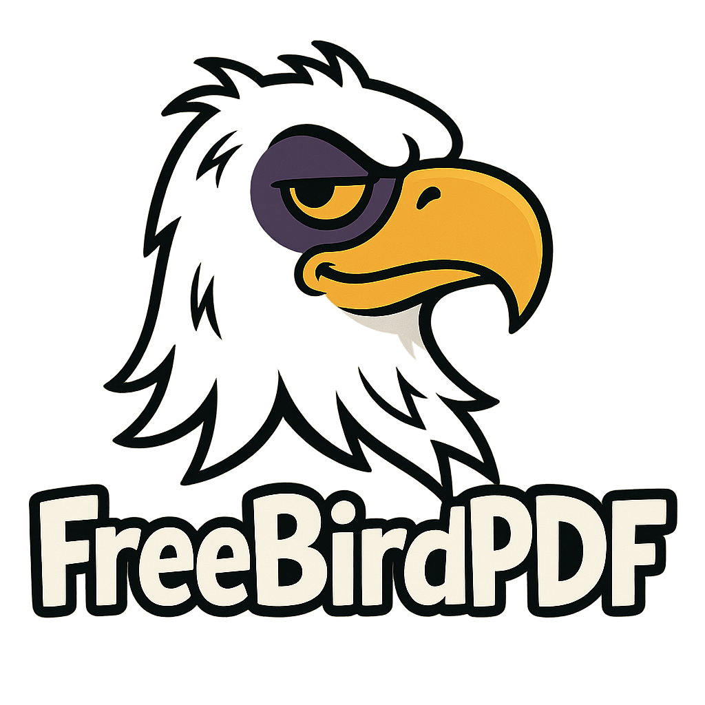

# Project FreeBird: The PDF Editor They Don't Want You To Have

*A [Bruised Ego Labs](https://github.com/bruised-ego-labs) Production*  
*Version 0.2.0 - Second Flight*

**(Codename: Acrobat's Nightmare)**


*(Patch the Eagle says: "Freedom isn't free, but your PDF editor definitely should be.")*

---

## What Our Users Are Saying*

> "After using FreeBirdPDF, I finally cancelled my $239/year Adobe subscription. My kids now have food."  
> — *Software Developer in Distress, Probably*

> "I rearranged 400 pages in my dissertation with FreeBirdPDF. My advisor still hates it, but now it's perfectly ordered garbage."  
> — *PhD Candidate, University of Perpetual Studies*

> "FreeBirdPDF saved my marriage. My spouse said either the $20/month PDF software subscription goes, or they do."  
> — *Someone Who Definitely Exists*

*\*Not actual testimonials. Patch the Eagle may have made these up during his coffee break.*

---

## Attention Adobe® Acrobat® Users: Your Reign of Subscription Tyranny Is Now Officially Under Siege.

You gaze upon **Project FreeBird**, a technological marvel painstakingly assembled using Python, PyQt6, and the surprisingly potent PyMuPDF library. We at Bruised Ego Labs dared to ask: "What if viewing, assembling, rearranging, and occasionally deleting pages from PDFs didn't require a second mortgage?"

This project is the answer nobody at Adobe wanted to hear. It's proof that sometimes, "good enough" is actually... well, available.

---

## Features That Will Send Shockwaves Through Silicon Valley*

(*Shockwaves may be localized and primarily consist of mild surprise.)

Prepare to be moderately whelmed by capabilities previously thought only possible within heavily marketed software suites:

* **Multi-Document Viewing:** Open *multiple* PDFs! At the *same time*! In *tabs*! Groundbreaking.
  
* **Pixel-Perfect* Page Viewing:** See your PDFs rendered on screen. (*Pixel perfection dependent on screen, zoom level, and PyMuPDF's mood.*)

* **Revolutionary Navigation:** Click "Next." Click "Previous." Type a page number and click "Go." Use the Left/Right arrow keys. Even **Home** and **End** keys work! We've spared no expense*. (*Expense spared: R&D department*)

* **The Power of Deletion:** Eradicate unwanted pages with the terrifying click of a "Delete Page" button! (Subject to confirmation, we're not monsters).

* **NEW! Page Reordering Wizardry:** Move pages up! Move pages down! Drag pages to new positions! Rearrange entire presentations in minutes, not hours! All without paying $239/year!

* **NEW! Text Search Technology:** Find words inside your documents! Watch as results highlight in real-time! Navigate with magical "Next" and "Previous" buttons!

* **Radical Saving Technology:** Use "Save" or "Save As..." to preserve your masterful deletions, assemblies, and now *reorderings* under the *same* or *different* name. Genius!

* **Document Assembly:** Right-click on a page in one tab, add it (or the whole document!) to a dedicated "Assembly" tab. Build your Franken-PDFs with unprecedented* ease! (*Ease may vary.*)

* **Zoom Control:** Make things bigger. Make things smaller. Mind. Blown.

* **Keyboard Shortcuts for Power Users:** Ctrl+S to save! Ctrl+Shift+Up/Down to move pages! Ctrl+F to search! F3 to find next! It's almost like we care about efficiency!

---

## Installation Options

### Option 1: Windows Executable (For the Command-Line Averse)

Can't be bothered with Python environments? We've got you covered with a pre-built Windows executable:

1. Download `FreeBirdPDF-0.2.0.exe` from the [Releases](https://github.com/bruised-ego-labs/FreeBirdPDF/releases) page
2. Double-click and enjoy your newfound PDF freedom

*Note: The executable is approximately 50MB because it contains all necessary dependencies. Yes, that's larger than a text editor should be. No, we're not going to apologize for it.*

### Option 2: From Source (For the Purists)

Fear not the complex installers of yesteryear! Project FreeBird requires only the sacred artifacts of the Python ecosystem:

1.  **Python:** Version 3.7+ recommended. If you don't have Python in 2025, are you even trying?
2.  **Pip:** The package manager that definitely won't break your system (probably).
3.  **Virtual Environment (Recommended):** Isolate the sheer power of this application. Navigate to the project directory in your terminal and run:
    ```bash
    python -m venv .venv
    ```
4.  **Activate the Portal:** Engage the virtual environment.
    * Windows (PowerShell): `.\.venv\Scripts\Activate.ps1` (You might need to appease the `Set-ExecutionPolicy` gods first).
    * Windows (CMD): `.\.venv\Scripts\activate.bat`
    * macOS/Linux: `source .venv/bin/activate`
5.  **Install the Arcane Libraries:** With the venv active, chant the following:
    ```bash
    pip install PyQt6 PyMuPDF
    ```
6.  **Invoke the Spell:** Run the application with:
    ```bash
    python FreeBirdPDF.py
    ```

---

## How to Use Advanced Features

### Page Reordering

* **Context Menu:** Right-click on any page to access "Move Page Up", "Move Page Down", or "Move Page To..." options
* **Reorder Button:** Click the "Reorder Pages" button to enter our revolutionary drag-and-drop thumbnail view
* **Keyboard Shortcuts:** Press Ctrl+Shift+Up or Ctrl+Shift+Down to move the current page

### Document Search

* **Search Bar:** Press Ctrl+F or click the "Search" button to reveal our state-of-the-art text search panel
* **Search Options:** Configure case sensitivity and whole word matching to your heart's content
* **Result Navigation:** Easily move between search hits with "Next" and "Previous" buttons or F3/Shift+F3

### Document Assembly

* **Multi-tab Magic:** Open several PDFs, then right-click on pages and add them to the assembly
* **Perfect Order:** Use our reordering tools to arrange your assembly document exactly as needed
* **Save:** Press Ctrl+S to save your masterpiece when it's ready

---

## How to Contribute

Did you stumble upon this project and, against all odds, find yourself wanting to contribute? We're as surprised as you are! Here's how:

1. **Fork the Repository:** Click that Fork button. You know you want to.
2. **Clone Your Fork:** `git clone https://github.com/yourusername/FreeBirdPDF.git`
3. **Create a Branch:** `git checkout -b fix-that-obvious-bug`
4. **Make Changes:** Preferably improvements, but we'll take what we can get.
5. **Push Changes:** `git push origin fix-that-obvious-bug`
6. **Submit a Pull Request:** Then wait patiently while Patch the Eagle struggles to remember how GitHub works.

### Development Guidelines

- **Code Style:** Python that runs is good Python.
- **Comments:** If your code is particularly mystifying, consider leaving breadcrumbs for future archaeologists.
- **Tests:** We've heard good things about them.
- **Version Tracking:** We follow a sophisticated versioning scheme called "numbers that get bigger."

## Support the Project

If this humble project has saved you from subscription fees or just brought a smile to your face, consider supporting Bruised Ego Labs:

- **GitHub Sponsors:** Coming soon! (Patch needs to eat)
- **Star the Repo:** It costs nothing and feeds our fragile egos.
- **Share the Project:** Tell your friends, especially the ones who complain about Adobe.
- **Contribute Code:** See above.

## License

This project is licensed under the MIT License - see the [LICENSE](LICENSE) file for details.

```
MIT License

Copyright (c) 2025 Bruised Ego Labs

Permission is hereby granted, free of charge, to any person obtaining a copy
of this software and associated documentation files (the "Software"), to deal
in the Software without restriction, including without limitation the rights
to use, copy, modify, merge, publish, distribute, sublicense, and/or sell
copies of the Software, and to permit persons to whom the Software is
furnished to do so, subject to the following conditions:

The above copyright notice and this permission notice shall be included in all
copies or substantial portions of the Software.

THE SOFTWARE IS PROVIDED "AS IS", WITHOUT WARRANTY OF ANY KIND, EXPRESS OR
IMPLIED, INCLUDING BUT NOT LIMITED TO THE WARRANTIES OF MERCHANTABILITY,
FITNESS FOR A PARTICULAR PURPOSE AND NONINFRINGEMENT. IN NO EVENT SHALL THE
AUTHORS OR COPYRIGHT HOLDERS BE LIABLE FOR ANY CLAIM, DAMAGES OR OTHER
LIABILITY, WHETHER IN AN ACTION OF CONTRACT, TORT OR OTHERWISE, ARISING FROM,
OUT OF OR IN CONNECTION WITH THE SOFTWARE OR THE USE OR OTHER DEALINGS IN THE
SOFTWARE.
```

## Acknowledgements

FreeBirdPDF was created with the assistance of several AI tools, each contributing their unique talents:

- **Gemini Advanced 2.5 Pro:** The initial mastermind who kickstarted this project and quickly adapted to our witty sarcasm.
- **ChatGPT 4.0:** Their image generator deftly birthed Patch the Eagle in all his majestic glory.
- **Claude 3.7 Sonnet (with extended thinking):** The wise elder of LLMs who swooped in to clean everything up as the code grew longer.

Additional thanks to:
- **PyMuPDF** for making PDF manipulation possible without selling our souls.
- **PyQt6** for bringing the 90s desktop UI aesthetic into the modern era.
- **You** for reading this far. Seriously, did you really read all of this?

## Contact

Have questions? Found a bug that wasn't intentional? Want to tell us how much better commercial PDF software is?

Email Patch the Eagle: patch.the.eagle@gmail.com

---

*Created with an equal mix of code, humor, mild frustration at proprietary PDF tools, and the dulcet sounds of Patch the Eagle screeching "FREEDOM!" in the background.*